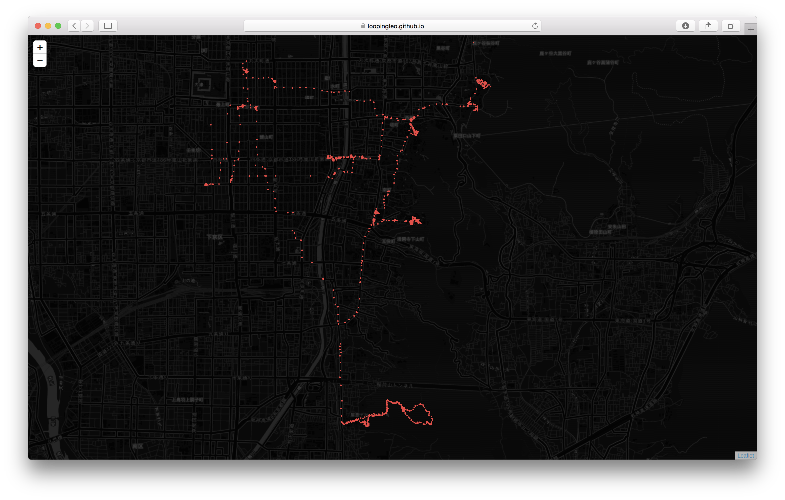

## Welcome to my GitHub page • GPS tracking


Check out my [visualization of GPS tracks in Kyoto](https://loopingleo.github.io/geolf/map/).


[](https://loopingleo.github.io/GPS-tracking/map/)
    
    

```python

locationlist = df[["lat","lon"]].values.tolist()
map = folium.Map(location=[np.mean(df['lat']), np.mean(df['lon'])], zoom_start=14)


for point in range(0, len(df), 30):
    if abs(df.speed[point]) < 10 / 3.6:
        folium.CircleMarker(locationlist[point], radius=0.0001,#/(1+ (df["speed"][point])**(4)),
                            color='#f44242', fill_opacity=0.13).add_to(map)

folium.TileLayer('cartodbdark_matter').add_to(map)
map

filepath = 'map.html'
map.save(filepath)

```

For more details see [GitHub](https://github.com/loopingleo/GPS-tracking).
